# Poletti Class-B Amplifier


## ⭐ Star me on GitHub!
[](https://www.linkedin.com/in/landon-viator-736bb719a/)
[](https://discord.gg/Rv5MEWgwwQ)
[](https://www.patreon.com/ViatorDSP)

## Table of Contents
- [About](#about)
- [Technical Details](#technical-details)
- [How to Build](#-how-to-build)
- [Documentation](#-documentation)
- [Feedback and Contributions](#-feedback-and-contributions)
- [License](#-license)
- [Contacts](#%EF%B8%8F-contacts)

## 🚀 About
This project is a custom DSP JUCE module that implements the Poletti Class-B Amplifier, as described 
by Will Pirkle in Chapter 19 of his Tube Amp Modeling Addendum. This module provides an authentic 
emulation of the vintage amplifier design, offering rich harmonic characteristics and dynamic response.

Key Features
- Accurate Emulation: Faithfully reproduces the nonlinear behavior of the Poletti Class-B amplifier, 
capturing its distinct tonal qualities.

- Versatile Applications: Suitable for a wide range of audio processing tasks, from music production to 
sound design.

- Customizable Parameters: Allows users to adjust various parameters to tailor the sound to their 
specific needs, including drive, mix, and output level.

## Technical Details
Will Pirkle illustrates the signal flow of the Poletti amplifier with the following diagram:

```mermaid
graph TD;
    input((input)) --> pos[Positive Asymmetrical Waveshaper]
    input --> neg[Negative Asymmetrical Waveshaper]
    
    pos --> hpf1[HPF]
    neg --> hpf2[HPF]
    
    hpf1 --> sym1[Symmetrical Waveshaper]
    hpf2 --> sym2[Symmetrical Waveshaper]
    
    sym1 --> sum1((Σ))
    sym2 --> sum1((Σ))
    
    sum1 --> output((output))
```

The waveshaper is described by the following piece-wise function:
```cpp
if (xn <= 0.0)
  yn = numerator / (1.0f - (numerator / ln));
else
  yn = numerator / (1.0f + (numerator / lp));
  ```
Here, `lp` and `ln` are the positive and negative limit values specified in Pirkle's paper. I've 
experimented with these parameters to closely replicate the waveform produced by Pirkle's original 
implementation.

